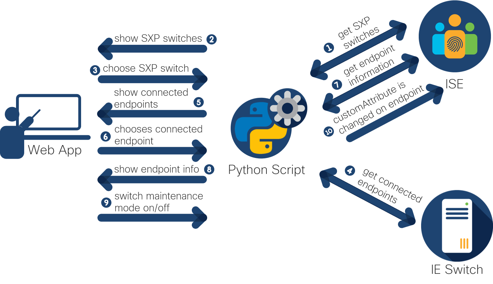
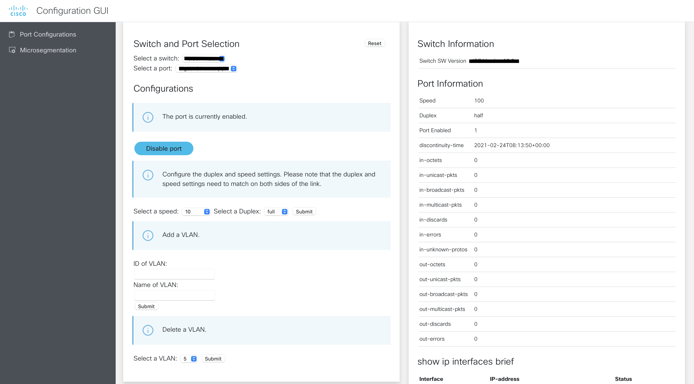
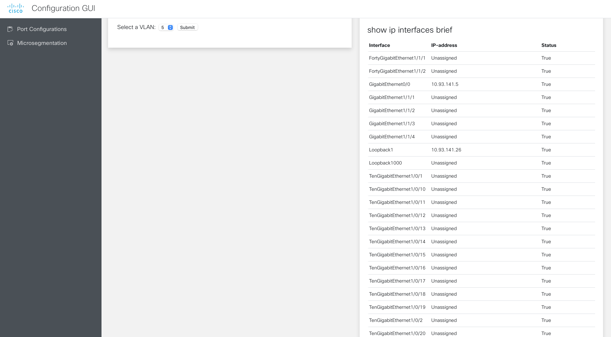
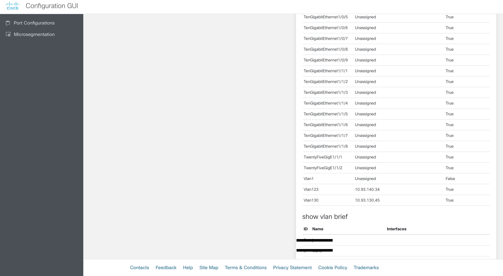

# Simple Port Configurations GUI
A simple interface to configure ports on switches. With this interface, we can enable and disable interfaces, add and delete VLANs and change speed and duplex settings per interface. We make the configurations using RESTCONF. Altogether, it allows remote teams to make simple configurations to the network.

## Workflow

## Interface

## Contacts
* Jara Osterfeld (josterfe@cisco.com)
* Simon Fang (sifang@cisco.com)

## Solution Components
* Python
* RESTCONF on device
* IOS-XE

## Prerequisites
- **RESTCONF**: Enable RESTCONF on the managed devices following [these instructions](https://developer.cisco.com/docs/ios-xe/#!enabling-restconf-on-ios-xe/authentication).

## Installation

1. Clone the repository

        $ git clone (link)

2. Open the `credentials.yml` file and add the following information:
    
        port_switches:
        - '' 
        port_switches_username: ''
        port_switches_password: ''
        vlans_to_exclude: []

3. (Optional) Create a Python virtual environment and activate it (find instructions [here](https://docs.python.org/3/tutorial/venv.html)).

4. In a terminal, install the requirements with `pip install -r requirements.txt`.

5. In a terminal, navigate to the root directory and start the Flask application by running `python main.py`. 

6. In a browser, go to `localhost:5001` to open the application.

## License
Provided under Cisco Sample Code License, for details see [LICENSE](./LICENSE.md).

## Code of Conduct
Our code of conduct is available [here](./CODE_OF_CONDUCT.md).

## Contributing
See our contributing guidelines [here](./CONTRIBUTING.md).
